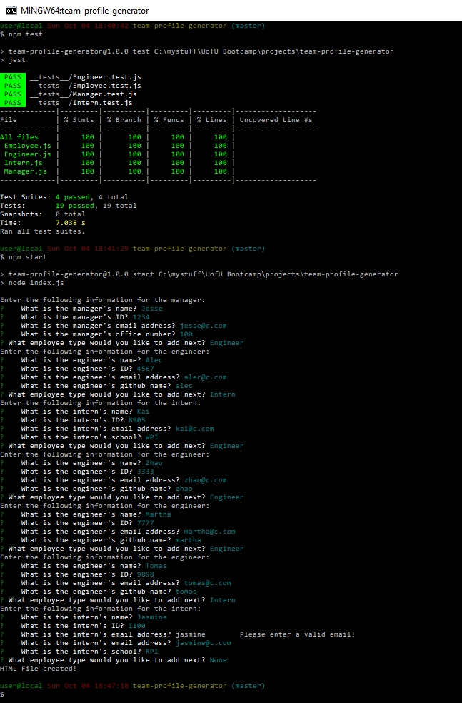
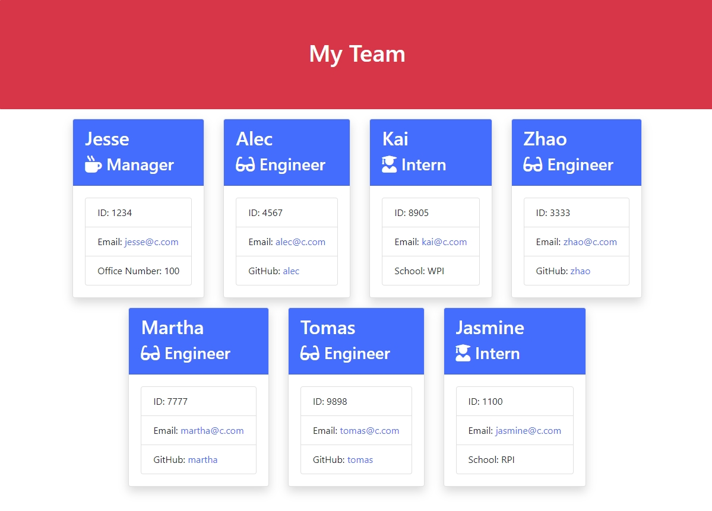

# Team Profile Generator

## Description 
A Node.js application that generates a webpage to display a team's basic info so that they have quick access to their emails and GitHub profiles.

## Table of Contents
* [Installation](#installation)
* [Usage](#usage)
* [License](#license)
* [Contributing](#contributing)
* [Tests](#tests)
* [Questions](#questions)
* [Screenshots](#screenshots)
* [Video](#video)

## Installation
npm install

## Usage 
This will generate a webpage to display a team's basic info. Use "node index.js" or "npm start" to run the file. The webpage will be produced in the "dist/" folder.

## License
This project uses The MIT License.

## Contributing
Feel free to contact me over email if you have some great ideas.

## Tests
Test manually as well as using "npm test" from the command line.

## Questions
Feel free to contact the developer at jesse@parent.com about contributing to https://github.com/jesseparent

## Screenshots
The user entering running tests and entering data into the command line interface:

The HTML page as rendered:

## Video
A video demo of this project can be found at https://screencast-o-matic.com/watch/cY6hcNKYaI 